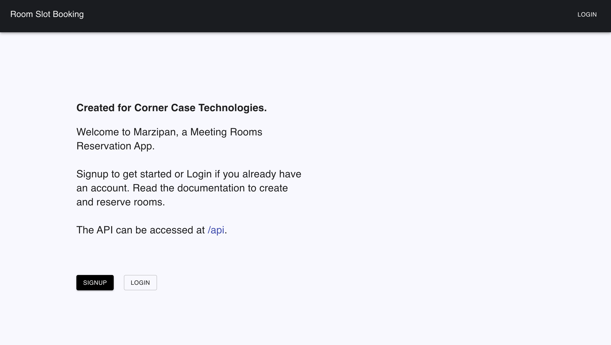
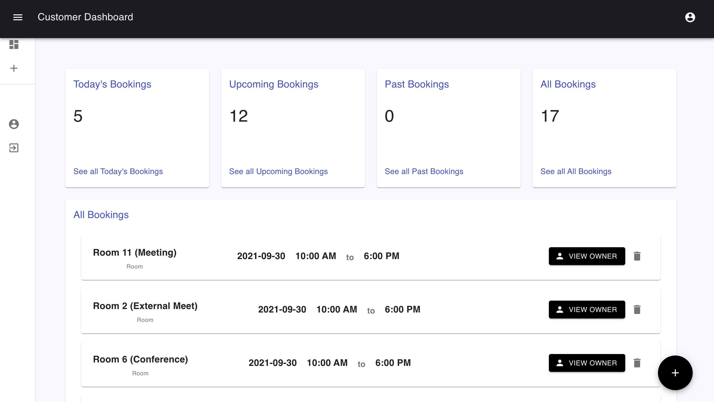
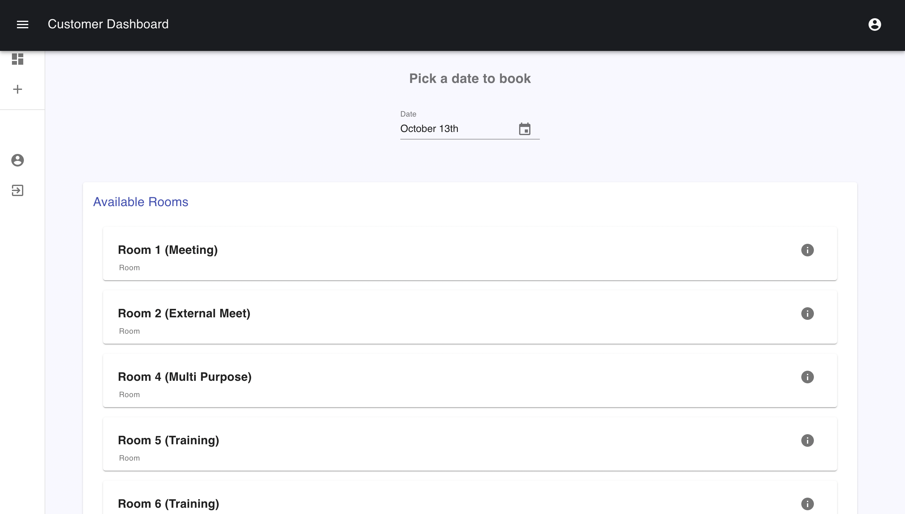

# Corner Case Meeting Room Reservation App
# (Marzipan)


Marzipan, a meeting room reservation app, created for corner case technologies. This app is developed with Django and Python3, Django Rest Framework, and React.js.


## Installation


```sh
git clone https://github.com/UrbanErrorist/Corner-case-meeting-room.git
cd Corner-case-meeting-room
sudo pip3 install virtualenv
virtualenv venvname
source venvname/bin/activate
cd src
pip3 install -r requirements.txt
```

I have included several tests. To test or run server use following command...

```sh
python3 manage.py test
python3 manage.py runserver
```


## Instructions to add and book slot

There are two possible roles in the App - Employee and Room manager

#### Room Manager

- Room manager can create rooms and assign slot for the created rooms
- Room manager can also view the employees who booked the slots.
- However, each room manager can only view the rooms/ slots created by them.
- Room manager can also assign the number of days in advanced the room can be booked.
- IMPORTANT: It is necessary to assign slot to the newly created room in order for rooms to be visible by the employees.

#### Employee

- Employee can use add booking button to book a room/slot for the required date.
- Employee can view all the booking created by any user.
- However, employee can only delete bookings created by them
- Employee can see owners of any booked rooms.


Room Manager needs to login as manager and then they can create rooms by using manage slot button. Then the manager can create slots by pressing clock icon towards the right of the room. Its is important to create slots for each room because otherwise rooms will not be visible by the employee. Manager can also edit and delete the rooms owned by them by pressing respective icons.

Employees can book slot by pressing plus button on the bottom right. After pressing the plus button, employees can see the available rooms and slot after chosing the date. Then, employee can easily select the required slot by pressing info icon towards the left on each room.


## Features

- Several automated tests are included for the Django project.
- PEP8 rules are followed
- React.js was used for the frontend
- API Endpoints are created for user login/signup, manage rooms, timeslots, bookings
- Swagger UI was used for the API Documentation


## Screenshots







